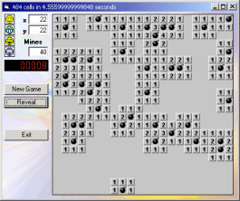



## MInesweeper

### Description

There was a recent app to solve minesweeper, so I thought what the hell why not write minesweeper!!!

It's no use to anyone, but it pure back to basics VB, no apis, dll calls, etc. I enjoyed writing this and hope you like playing/tweaking it!
 
### More Info
 
pleasure!

none that I know of

             |
---                |---
**Submitted On**   |2001-06-08 21:45:12
**By**             |[Mike Toye](https://github.com/Planet-Source-Code/PSCIndex/blob/master/ByAuthor/mike-toye.md)
**Level**          |Intermediate
**User Rating**    |4.7 (14 globes from 3 users)
**Compatibility**  |VB 5\.0, VB 6\.0
**Category**       |[Games](https://github.com/Planet-Source-Code/PSCIndex/blob/master/ByCategory/games__1-38.md)
**World**          |[Visual Basic](https://github.com/Planet-Source-Code/PSCIndex/blob/master/ByWorld/visual-basic.md)
**Archive File**   |[MInesweepe20831682001\.zip](https://github.com/Planet-Source-Code/mike-toye-minesweeper__1-23897/archive/master.zip)

